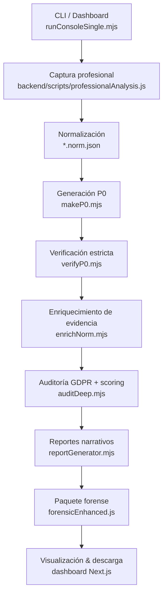

# Spectral

Spectral es una plataforma end-to-end para auditar cumplimiento GDPR/ePrivacy, centrada en flujos de consentimiento OneTrust. El proyecto automatiza la captura de evidencias con Puppeteer, clasifica cookies y tracking mediante heurísticas + aprendizaje incremental y entrega reportes accionables para equipos legales, técnicos y de marketing. Además ofrece un dashboard web (Next.js) para monitorear ejecuciones y explorar resultados forenses.

## Características clave
- Pipeline automatizado de 9 etapas: captura, normalización, validación, enriquecimiento, auditoría, reportes y empaquetado forense.
- Soporte completo para CMP OneTrust con análisis limitado automático para otros CMPs.
- Motor de inteligencia de cookies (`backend/cookieIntelligence.js`) y sistema de aprendizaje continuo (`data/cookie_learning.json`) que disminuyen falsos positivos.
- Generación de múltiples artefactos: `.json` crudo, `.norm.json`, `.p0.json`, `.report.json`, reportes en texto por perfil y paquetes forenses con hashes SHA-256.
- Dashboard Next.js que dispara ejecuciones (`/api/analyze`), lista análisis recientes y muestra violaciones/GDPR con evidencias y capturas.

## Flujo del pipeline



### Codeviz Flow:
```mermaid
graph TD

    user["User<br>[External]"]
    external_website["External Website<br>/backend/spectralCrawler.js"]
    subgraph spectral_system["Spectral System<br>[External]"]
        subgraph dashboard_system["Dashboard System<br>/dashboard/"]
            subgraph dashboard_webapp_boundary["Dashboard Web Application<br>/dashboard/app/"]
                dashboard_ui["Dashboard UI<br>/dashboard/app/page.js"]
                dashboard_api_routes["Dashboard API Routes<br>/dashboard/app/api/"]
                frontend_api_client["Frontend API Client<br>/dashboard/lib/api.js"]
                %% Edges at this level (grouped by source)
                dashboard_ui["Dashboard UI<br>/dashboard/app/page.js"] -->|"Calls | HTTP/JSON"| dashboard_api_routes["Dashboard API Routes<br>/dashboard/app/api/"]
                dashboard_api_routes["Dashboard API Routes<br>/dashboard/app/api/"] -->|"Uses to call | HTTP/JSON"| frontend_api_client["Frontend API Client<br>/dashboard/lib/api.js"]
            end
        end
        subgraph backend_system["Backend System<br>/backend/"]
            subgraph backend_api_boundary["Backend API<br>/backend/"]
                cookie_intelligence_module["Cookie Intelligence<br>/backend/cookieIntelligence.js"]
                cookie_learning_module["Cookie Learning<br>/backend/cookieLearning.js"]
                cmp_detection_module["CMP Detection<br>/backend/detectCMP.js"]
                p0_generation_module["P0 Generation<br>/backend/makeP0.mjs"]
                p0_verification_module["P0 Verification<br>/backend/verifyP0.mjs"]
                crawler_orchestration_module["Crawler Orchestration<br>/backend/spectralCrawler.js"]
                cookie_learning_data["Cookie Learning Data<br>/backend/data/cookie_learning.json"]
                %% Edges at this level (grouped by source)
                backend_api_boundary["Backend API<br>/backend/"] -->|"Uses"| cookie_intelligence_module["Cookie Intelligence<br>/backend/cookieIntelligence.js"]
                backend_api_boundary["Backend API<br>/backend/"] -->|"Uses"| cookie_learning_module["Cookie Learning<br>/backend/cookieLearning.js"]
                backend_api_boundary["Backend API<br>/backend/"] -->|"Uses"| cmp_detection_module["CMP Detection<br>/backend/detectCMP.js"]
                backend_api_boundary["Backend API<br>/backend/"] -->|"Uses"| p0_generation_module["P0 Generation<br>/backend/makeP0.mjs"]
                backend_api_boundary["Backend API<br>/backend/"] -->|"Uses"| p0_verification_module["P0 Verification<br>/backend/verifyP0.mjs"]
                backend_api_boundary["Backend API<br>/backend/"] -->|"Triggers"| crawler_orchestration_module["Crawler Orchestration<br>/backend/spectralCrawler.js"]
                cookie_learning_module["Cookie Learning<br>/backend/cookieLearning.js"] -->|"Reads/Writes | JSON"| cookie_learning_data["Cookie Learning Data<br>/backend/data/cookie_learning.json"]
            end
            subgraph crawler_service_boundary["Crawler Service<br>/backend/spectralCrawler.js"]
                crawler_core["Crawler Core<br>/backend/spectralCrawler.js"]
            end
            %% Edges at this level (grouped by source)
            crawler_core["Crawler Core<br>/backend/spectralCrawler.js"] -->|"Uses | Reads/Writes"| cookie_learning_data["Cookie Learning Data<br>/backend/data/cookie_learning.json"]
            crawler_orchestration_module["Crawler Orchestration<br>/backend/spectralCrawler.js"] -->|"Invokes"| crawler_service_boundary["Crawler Service<br>/backend/spectralCrawler.js"]
        end
        %% Edges at this level (grouped by source)
        frontend_api_client["Frontend API Client<br>/dashboard/lib/api.js"] -->|"Calls | HTTP/JSON"| backend_api_boundary["Backend API<br>/backend/"]
    end
    %% Edges at this level (grouped by source)
    user["User<br>[External]"] -->|"Uses | Web Browser"| dashboard_ui["Dashboard UI<br>/dashboard/app/page.js"]
    crawler_core["Crawler Core<br>/backend/spectralCrawler.js"] -->|"Crawls and analyzes | HTTP/HTTPS"| external_website["External Website<br>/backend/spectralCrawler.js"]
```

## Documentación

### Documentos principales

| Documento | Descripción |
|-----------|-------------|
| [PRD.md](docs/PRD.md) | Product Requirements Document - Especificaciones completas del producto SaaS (features, personas, métricas) |
| [ROADMAP.md](docs/ROADMAP.md) | Roadmap detallado en 3 fases: MVP SaaS (8 semanas), Growth (8 semanas), Enterprise + Multi-CMP (8 semanas) |
| [documentacion_spectral_v4.8.md](docs/documentacion_spectral_v4.8.md) | Documentación histórica v4.8 - Pipeline actual, validación multi-país, soporte OneTrust |

### Análisis técnico (archivo)

Los siguientes documentos contienen análisis técnicos detallados realizados por equipos especializados. Han sido archivados en `docs/archive/` como referencia:

- **SPECTRAL_MVP_STRATEGY.md** - Estrategia consolidada de implementación con stack Vercel + Supabase
- **backend_architecture_analysis.md** - Evaluación crítica de arquitectura backend y pipeline
- **kubernetes_devops_assessment.md** - Análisis de infraestructura y DevOps
- **ux_analysis_saas.md** - Análisis UI/UX y modelo freemium
- **component_specs.md** - Especificaciones de componentes y design system

Ver `docs/archive/` para acceder a estos documentos.

## Estructura de carpetas

```
.
├── backend/                   # Crawler Puppeteer, inteligencia y scripts de aprendizaje
│   ├── spectralCrawler.js      # Flujo OneTrust multi-stage (baseline, reject, accept…)
│   ├── scripts/                # professionalAnalysis.js y herramientas de entrenamiento
│   ├── cookieIntelligence.js   # Heurísticas conocidas de cookies/servicios
│   └── cookieLearning.js       # Base de conocimiento persistente (JSON)
├── runConsoleSingle.mjs        # Orquestador del pipeline completo (CLI)
├── runConsoleBatch.mjs         # Variante batch para múltiples URLs
├── auditDeep.mjs               # Motor de auditoría GDPR y scoring
├── enrichNorm.mjs              # Complementa norm.json con evidencia ampliada
├── reportGenerator.mjs         # Genera reportes para legal/marketing/tech/console
├── forensicEnhanced.js         # Arma paquetes forenses con hashes y HAR-lite
├── data/
│   └── cookie_learning.json    # Conocimiento aprendido entre ejecuciones
├── docs/
│   └── documentacion_spectral_v4.8.md  # Documentación funcional histórica
├── dashboard/                  # Dashboard Next.js 15 (React 19)
│   ├── app/                    # Páginas, API routes y UI
│   └── lib/api.js              # Lectura de reportes/screenhots en file system
└── screenshots/                # Capturas de cada stage (generadas en runtime)
```

## Requisitos
- Node.js 18.17+ en la raíz (Puppeteer 24 y scripts CLI).
- Dependencias de sistema para Chromium (la instalación de Puppeteer descarga un binario por defecto).
- Para el dashboard: Node.js 20+ recomendado para Next 15/Turbopack.
- Acceso a Internet durante las ejecuciones (necesario para auditar sitios y descargar Chrome si no existe cache).

## Puesta en marcha

### 1. Instalar dependencias del pipeline
```bash
npm install
```

### 2. Ejecutar un análisis completo
```bash
node runConsoleSingle.mjs --host https://ejemplo.com --lang es --zip
```
- `--lang` propaga el locale a Puppeteer (útil para reproducir banners por país).
- `--zip` invoca herramientas opcionales de empaquetado (`src/tools/forensicZip.mjs` si existe).
- La ejecución produce artefactos en `./reports/` y capturas en `./screenshots/`.

Para ejecutar múltiples dominios en cadena puedes usar `node runConsoleBatch.mjs` (espera un archivo `urls.txt` o modificar el script).

### 3. Revisar resultados
- `.report.json` y los `.txt` asociados contienen la narrativa para diferentes audiencias.
- `forensic-*/` guarda evidencia firmada y hashes para cadena de custodia.
- `docs/documentacion_spectral_v4.8.md` documenta hallazgos y métricas históricas (v4.8).

### 4. Dashboard (opcional)
```bash
cd dashboard
npm install
npm run dev
```
El dashboard utiliza rutas API locales que acceden al file system del proyecto. Por defecto `app/api/analyze/route.js` espera encontrar `runConsoleSingle.mjs` en `~/Desktop/Spectral`. Si cambiás la ubicación del repo, ajusta `scriptPath`/`spectralDir` en ese archivo antes de lanzar producción.

## Buenas prácticas y notas
- El pipeline actualmente ofrece análisis “full” únicamente para CMP OneTrust. Otros CMPs se procesan en modo “limited” con advertencias claras en los reportes.
- Mantén el archivo `data/cookie_learning.json` bajo control de versiones para aprovechar el aprendizaje incremental entre ejecuciones.
- `auditDeep.mjs --strict` puede finalizar con código no cero cuando encuentra violaciones críticas; el orquestador ya tolera este comportamiento.
- Antes de producir entregables, ejecuta `node scripts/manifest-tools.cjs verify reports/forensic` (definido en `package.json`) para validar integridad de los paquetes forenses.

## Recursos adicionales
- Documentación ampliada, métricas y roadmap: `docs/documentacion_spectral_v4.8.md`.
- Scripts auxiliares para backups y auditoría del workspace: ver `scripts/` y `backupSpectral.sh`.
- Capturas de ejemplo del dashboard: carpeta `screenshots/`.
